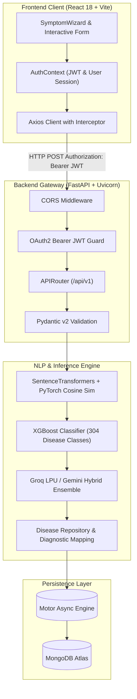

# 🩺 MediVerse — AI-Powered Clinical Diagnostic Platform

[](https://fastapi.tiangolo.com/)
[](https://react.dev/)
[](https://vitejs.dev/)
[](https://www.python.org/)
[](https://www.docker.com/)
[](https://www.mongodb.com/)

**MediVerse** is an end-to-end, full-stack medical diagnostic and symptom recommendation web application. It translates free-form natural language patient symptom descriptions (e.g., *"sharp chest pain, difficulty breathing, and mild fever for two days"*) into calibrated top-3 differential disease diagnoses along with structured medical guidance (recommended OTC medications, diagnostic lab tests, precautions, specialist recommendations, and severity levels).

---

## 🌟 Key Features

- **🩺 Natural Language Symptom Parsing**: Maps free-form user text into a 286-dimensional binary feature vector using dense Transformer sentence embeddings (`SentenceTransformers` `all-MiniLM-L6-v2`) and PyTorch cosine similarity matching.
- **🧠 Dual-AI Hybrid Ensemble Engine**: Combines gradient-boosted decision tree probabilities (`XGBoost` over 304 target disease classes) with Groq LPU / Google Gemini LLM reasoning for high-precision differential diagnosis.
- **🔒 Enterprise Security & Auth**: Full authentication pipeline featuring OAuth2 Bearer JWT authorization, Bcrypt password hashing with 72-byte UTF-8 guards, and 6-digit OTP password reset.
- **📊 Diagnostic Reports & History Dashboard**: Generates comprehensive patient health reports detailing recommended diagnostic lab tests, OTC medicines, and precautions, with historical logging powered by MongoDB Atlas.
- **🐳 Cloud-Native Docker Execution**: Multi-stage containerized architecture optimized for non-root execution (UID 1000) on Hugging Face Spaces on port `7860`.

---

## 📐 System Architecture



---

## 🛠️ Tech Stack

| Domain | Technology | Usage |
| :--- | :--- | :--- |
| **Frontend** | React 18, Vite, React Router v6 | Single Page Application (SPA), state management, dynamic routing |
| **Styling** | Vanilla CSS, Glassmorphism | Custom design tokens, responsive layouts, micro-animations |
| **Backend** | Python 3.12, FastAPI, Uvicorn | Asynchronous ASGI REST API framework, Pydantic schemas |
| **NLP & ML** | `SentenceTransformers`, PyTorch, `XGBoost` | Dense embeddings, cosine similarity vectorization, XGBoost inference |
| **LLM Ensemble** | Groq LPU API, Google Gemini API | Hybrid differential diagnosis consensus ranker |
| **Database** | MongoDB Atlas, Motor | Non-blocking async document storage for users & diagnosis history |
| **Security** | PyJWT, Passlib (Bcrypt), Nodemailer | JWT bearer tokens, salted password hashing, OTP verification |
| **DevOps** | Docker, Hugging Face Spaces | Containerized non-root execution on port 7860 |

---

## 📁 Repository Structure

```
MediVerse/
├── backend/                              # FastAPI Backend Microservice
│   ├── app/
│   │   ├── auth/                         # JWT authentication, Bcrypt security, OTP reset
│   │   ├── config/                       # Settings & environment variable configuration
│   │   ├── data/                         # Medical knowledge base (diseases.json, diagnostic_tests.json)
│   │   ├── database/                     # MongoDB client & Motor collections
│   │   ├── history/                      # Async diagnosis history logging
│   │   ├── ml/                           # XGBoost DiseasePredictor & feature loading logic
│   │   ├── nlp/                          # SentenceEmbedder & PyTorch SimilarityEngine
│   │   ├── routes/                       # FastAPI API router endpoints (/api/v1/predict, /auth, etc.)
│   │   ├── schema/                       # Pydantic v2 validation models
│   │   ├── services/                     # PredictionService orchestration & LLM ensemble
│   │   └── main.py                       # FastAPI entry point & CORS configuration
│   ├── models/                           # Trained xgboost.json, symptom_embeddings.pt
│   ├── artifacts/                        # label_encoder.pkl, feature_names.pkl
│   ├── Dockerfile                        # Backend Docker setup
│   └── requirements.txt                  # Python dependencies
├── frontend/                             # React 18 Web Client
│   ├── src/
│   │   ├── components/                   # SymptomWizard, ForgotPasswordModal, Navbar, Widgets
│   │   ├── context/                      # AuthContext for session management
│   │   ├── pages/                        # Home, Diagnosis, History, Login, Register, Profile
│   │   ├── services/                     # Axios API client layer with JWT interceptors
│   │   └── routes.jsx                    # React Router configuration & ProtectedRoute guards
│   ├── package.json                      # Frontend dependencies
│   └── vite.config.js                    # Vite bundler configuration
├── Dockerfile                            # Root Dockerfile for Hugging Face Spaces deployment
└── README.md                             # Project documentation
```

---

## ⚡ Quick Start Guide

### Prerequisites
- **Python**: `3.12+`
- **Node.js**: `18.0+`
- **MongoDB**: Active MongoDB Atlas cluster or local MongoDB instance

---

### 1. Backend Setup

```bash
# Navigate to backend directory
cd backend

# Create and activate virtual environment
python -m venv venv
# On Windows:
venv\Scripts\activate
# On Linux/macOS:
source venv/bin/activate

# Install dependencies
pip install -r requirements.txt

# Create .env file
cat <<EOT > .env
MONGODB_URL=mongodb+srv://<username>:<password>@cluster.mongodb.net/?appName=MediVerse
DATABASE_NAME=mediverse
JWT_SECRET_KEY=your_super_secret_jwt_key_here
GROQ_API_KEY=your_groq_api_key_here
GEMINI_API_KEY=your_gemini_api_key_here
EOT

# Start FastAPI dev server
uvicorn app.main:app --reload --host 0.0.0.0 --port 7860
```
> Interactive API Docs will be available at: `http://localhost:7860/docs`

---

### 2. Frontend Setup

```bash
# Navigate to frontend directory
cd frontend

# Install Node.js dependencies
npm install

# Start Vite development server
npm run dev
```
> Frontend application will be running at: `http://localhost:5173`

---

### 3. Running with Docker

```bash
# Build Docker image
docker build -t mediverse-api .

# Run Docker container
docker run -d -p 7860:7860 --env-file backend/.env mediverse-api
```

---

## 🔑 Environment Variables Reference

| Variable | Required | Description |
| :--- | :--- | :--- |
| `MONGODB_URL` | **Yes** | MongoDB Atlas connection string |
| `DATABASE_NAME` | No | Database name (default: `mediverse`) |
| `JWT_SECRET_KEY` | **Yes** | Secret key for signing HS256 JWT access tokens |
| `JWT_ALGORITHM` | No | Algorithm for JWT signatures (default: `HS256`) |
| `ACCESS_TOKEN_EXPIRE_MINUTES` | No | Token lifetime in minutes (default: `60`) |
| `GROQ_API_KEY` | No | Groq Cloud API key for ultra-fast LPU LLM ensemble |
| `GEMINI_API_KEY` | No | Google Gemini API key for fallback LLM ensemble |
| `SMTP_USER` | No | Email address for sending OTP password resets |
| `SMTP_PASSWORD` | No | App password for SMTP authentication |

---

## 🧪 API Endpoints Overview

| Method | Endpoint | Protection | Description |
| :--- | :--- | :--- | :--- |
| `POST` | `/api/v1/auth/register` | Public | Registers a new user account |
| `POST` | `/api/v1/auth/login` | Public | Authenticates user & returns JWT access token |
| `GET` | `/api/v1/auth/me` | Protected | Returns authenticated user details |
| `POST` | `/api/v1/auth/forgot-password` | Public | Sends password reset OTP to email |
| `POST` | `/api/v1/auth/reset-password` | Public | Verifies OTP & resets password |
| `POST` | `/api/v1/predict` | Protected | Runs NLP/ML prediction pipeline on symptoms |
| `GET` | `/api/v1/history` | Protected | Retrieves paginated user prediction history |
| `GET/PUT` | `/api/v1/profile` | Protected | Retrieves or updates patient medical profile |

---

## ⚠️ Disclaimer

> **IMPORTANT CLINICAL DISCLAIMER**: 
> **MediVerse** is an artificial intelligence prototype developed strictly for educational, demonstration, and research purposes. It does **not** constitute professional medical advice, clinical diagnosis, or treatment recommendations. Always consult a qualified healthcare professional or emergency medical services for medical concerns.

---

## 📄 License

Distributed under the MIT License. See `LICENSE` for more details.